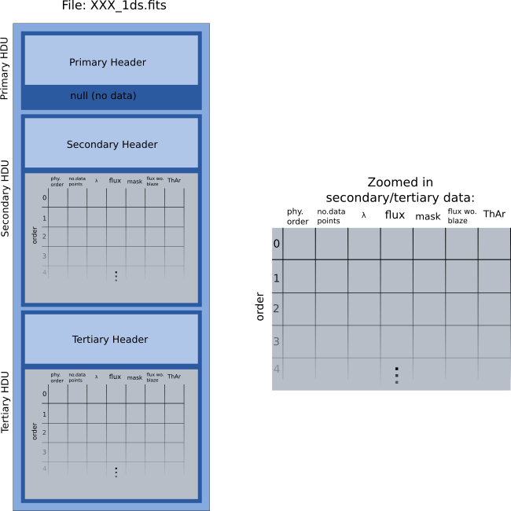

.. _fits_output:

Structure of Output Files
==========================

The following pictures show the main data structure of the output file (which is named by `XXX_1ds.fits`).
    * **Primary HDU**

        * *Header* - Contains mostly the headers from the original science files but extended by some useful informations which are araised during the data reduction procedure.

        * *Data*   - No data

    * **Secondary HDU** or **Tertiary HDU** *(if any)*
        Contain the data from the *first* and *second* fiber.

        * *Header* - Lists the description of the binary table in this HDU

        * *Data*   - Contains a binary table. Each row in this array contains the data from one order of a fiber. For each row the following values are stored:

            1. (*integer*\ ) Physical order number
            2. (*integer*\ ) Number of data points contained in this order
            3. (*1-d array*\ ) Wavelength of each pixel
            4. (*1-d array*\ ) Flux
            5. (*1-d array*\ ) Mask (information of which pixel is affected by cosmic rays, or bad pixels...)
            6. (*1-d array*\ ) Flux without correcting the blaze functions
            7. (*1-d array*\ ) Flux of the comparison lamp

