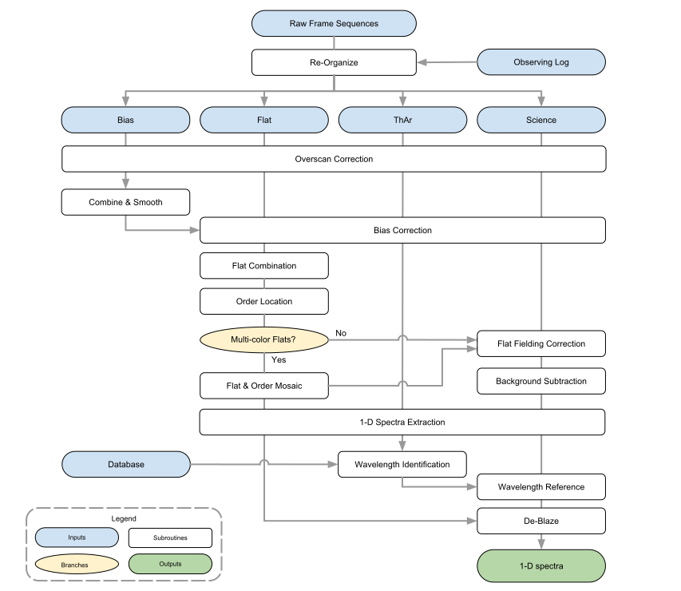

GAMSE Documentation
===================

.. image:: images/gamse.svg
    :alt: GAMSE logo
    :width: 250px

`GAMSE` is a data reduction package for high-resolution échelle spectrographs.
It contains necessary subroutines in spectral reduction process, including
overscan correction, bias subtraction, order detection, flat-fielding
correction, background correction, and optimal extraction.
GAMSE supports a variety of instruments, e.g. FOCES on the 2m Fraunhofer
Telescope in Wendelstein Observatory, and HRS on the 2.16m telescope in Xinglong
Observatory.

Dependencies
------------
`GAMSE` is based on Python 3.4 or later, and does not work in Python 2.x.
To use `GAMSE` the following packages are required:

* `Numpy <http://www.numpy.org/>`_ 1.16.1 or later: A Python library for
  multi-dimensional arrays and mathematics.
* `Scipy <https://www.scipy.org/>`_ 0.17.0 or later: A Python library for
  scientific computing.
* `Matplotlib <https://matplotlib.org/>`_ 2.2.0 or later: To display and
  generate output figures.
* `Astropy <http://www.astropy.org/>`_ 3.1.1 or later: To read and write FITS
  files and ASCII tables.

Installation
------------

To install `GAMSE` package with `pip`, simply usethe following command:

.. code-block:: bash

   sudo pip install gamse

Or alternatively, clone the whole repository with GIT:

.. code-block:: bash

   git clone https://github.com/wangleon/gamse.git

Then run the setup script in the cloned directory:

.. code-block:: bash

   sudo python3 setup.py install

General Description
-------------------
The reduction procedure and the input parameters are controlled by an
user-defined ASCII configuration file.
It consists of a series of key/values delimited by the equal signs.
Comments prefixed by hash (#) or semicolons (;) symbols are supported,

.. _getting_started:

Getting Started with GAMSE
--------------------------
Extracting one-dimensional spectra from raw images using `GAMSE` is simple.
Basically there are only 4 steps

#. Prepare a working directory and link the raw data.
#. Create an ASCII config file by running

   .. code-block:: bash

      gamse config

#. Generate an observing log file by running
  
   .. code-block:: bash

      gamse list

#. Calibrate the data and extract the spectra by running
  
   .. code-block:: bash

      gamse reduce

However, the config and observing log files for a specific instrument might be
slightly different with others, as every spectrograph is different with others.
We recommend the users to reduce their data following the guide of individual
spectrograph.

Supported Spectrographs
-----------------------
* :ref:`FOCES<manual_foces>` on 2m Fraunhofer Telescope in Wendelstein
  Observatory
* :ref:`HRS<manual_xinglong216hrs>` on 2.16m telescope in Xinglong
  Observatory
.. * :ref:`Levy<>` on APF
.. * :ref:`HIRES<pipeline_hires>` on 10m Keck II Telescope in  W. M. Keck Observatory

Spectral Reduction Process
--------------------------

Indices and Tables
--------------------

* :ref:`genindex`
* :ref:`modindex`
* :ref:`search`

