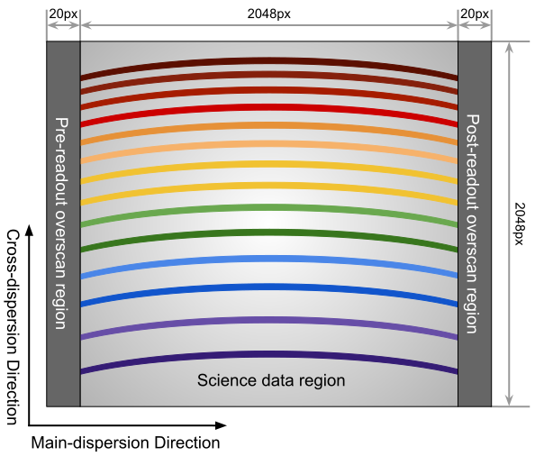

.. _manual_foces:

Reduction Manual for FOCES
==========================

Introduction to the Instrument
------------------------------
Fibre Optics Cassegrain Echelle Spectrograph (FOCES, Pfeiffer et al. 1998
[#Pfeiffer1998]_) was originally mounted to the Cassegrain focus of the 2.2m
telescope in Calar Alto Observatory, Spain.
After 15 years of operation, the spectrograph was brought back to `University
Observatory Munich (USM) <http://www.usm.uni-muenchen.de/>`_ for a major
upgrade (Grupp et al. 2009 [#Grupp2009]_, 2010 [#Grupp2010]_) to meet the
requirements for precision spectroscopy, such as searching for extra-solar
planets with the Doppler method.
In the summer of 2017, FOCES was successfully mounted on the 2m Fraunhofer
Telescope (Hopp et al. 2014 [#Hopp2014]_) at the `Wendelstein Observatory
<http://www.wendelstein-observatorium.de:8002/wst_en.html>`_ in Southern
Bavaria, Germany.
FOCES is connected to a Nasmyth focus of the telescope via an octagonal
multi-mode optical fiber.
FOCES has a resolving power (*R*) of ~ 70,000, and covers the wavelength range
of 390 - 900 nm.

The characteristics of FOCES are summarised as below:

+---------------------------+---------------------------------+---------------------------------------+
| **Main-disperser**        | Spectral resovling power        | *R* = *λ*\ /Δ\ *λ* = 70,000           |
|                           +---------------------------------+---------------------------------------+
|                           | Groove density                  | 31.6 lines mm\ :sup:`−1`              |
|                           +---------------------------------+---------------------------------------+
|                           | Blazing angle                   |                                       |
+---------------------------+---------------------------------+---------------------------------------+
| **Corss-disperser**       | A pair of prisms                                                        |
+---------------------------+---------------------------------+---------------------------------------+
| **CCD Detector**          | Wavelength coverage             | 390 - 900 nm                          |
|                           +---------------------------------+---------------------------------------+
|                           | Number of pixels                | 2048 x 2048                           |
|                           +---------------------------------+---------------------------------------+
|                           | Pixel size                      | 13.5 μm                               |
|                           +---------------------------------+---------------------------------------+
|                           | Sampling per resolution element | ~2.3 pixels                           |
+---------------------------+---------------------------------+---------------------------------------+
| **Others**                | Link to the telescope           | A circular multi-mode fiber (100µm)  |
|                           +---------------------------------+---------------------------------------+
|                           | Wavelength calibration          | ThAr/astrocomb simultaneous reference |
+---------------------------+---------------------------------+---------------------------------------+

Preparing Data & Config File
----------------------------
The first step is to create a new working directory in a place where the user has
full read/write permissions.
All the steps performed by `GAMSE` will be done in this directory.
For example, the following commands create a new working directory called
``foces.2018-07-18``, where the FOCES data taken on July 18, 2018, will be
reduced here.

.. code-block:: bash

   mkdir foces.2018-07-18
   cd foces.2018-07-18

Then, a text file containing the necessary information is required to tell
`GAMSE` which instrument the data is obtained with, and the path to raw data.
The name of the text file is arbitrary, but the suffix must be ``.cfg``.
The user must make sure there is only one ``.cfg`` file in the working
directory.
For example, a text file called ``foces-2018-07-18.cfg`` with the following
content is created:
::

    [data]
    telescope  = Fraunhofer
    instrument = FOCES
    rawdata    = rawdata

With the first two keywords `GAMSE` will call the FOCES pipeline to reduce the
data.
The third keyword ``rawdata`` tells the software the path to the raw images.
The default value is a sub-directory called ``rawdata`` in the working
directory.
The user may want to keep the raw data in their original places, but to use a
soft link to the actual data path, instead.
For example, the raw images taken on July 18, 2018, are in
``/data/foces/rawdata/2018/0718/``, and the following command is to create a
soft link called ``rawdata`` in the working directory:

.. code-block:: bash

   ln -s /data/foces/rawdata/2018/0718 rawdata

Alternatively, one can use the actual data path in the configuration file:
::

    [data]
    telescope  = Fraunhofer
    instrument = FOCES
    rawdata    = /data/foces/rawdata/2018/0718

In this case, the soft link to the data path is not necessary anymore.

The ``data`` section in the configuration file accepts the following entries:

.. csv-table:: Accepted entries in ``data`` section
   :header: Key, Type, Default Value, Description
   :escape: '
   :widths: 18, 10, 18, 60

   **telescope**,   *str*, Fraunhofer, Name of the telescope (Fixed).
   **instrument**,  *str*, FOCES,      Name of the instrument (Fixed).
   **rawdata**,     *str*, rawdata,    Path to the rawdata.
   **statime_key**, *str*, FRAME,      Key of starting time of exposure in FITS header.
   **exptime_key**, *str*, EXPOSURE,   key of exposure time in FITS header.

Generating the Observing Log
----------------------------
The following command scans all the FITS files in the data path as specified
in the configure file:

.. code-block:: bash

   gamse list

``GAMSE`` will extract some information from the FITS files and print an
observing log as a table in the terminal:
::

    ------ ------------------------------ ------- ------------ ------- ----------------------- ------- ------
    frameid             fileid             imgtype    object    exptime         obsdate          nsat    q95  
    ------- ------------------------------ ------- ------------ ------- ----------------------- ------- ------
          0 20180718_0001_FOC1800_SCI0       sci   Unknown           20 2018-07-18T20:55:47.000       0  23228
    ... ...
          0 20180718_0017_FOC1800_THA1       cal   ThAr             1.5 2018-07-18T21:44:26.000   13503   1069
          0 20180718_0018_FOC1800_SCI0       sci   Unknown          180 2018-07-18T22:23:37.000       0    943
    ... ...
          0 20180719_0012_FOC1800_THA1       cal   ThAr             1.5 2018-07-19T01:43:28.000   13305   1066
          0 20180719_0013_FOC1800_THA2       cal   ThAr               3 2018-07-19T01:45:35.000   23582   1241
          0 20180719_0014_FOC1800_FLA1       cal   Flat             1.5 2018-07-19T01:50:33.000       9  21349
          0 20180719_0023_FOC1800_FLA1       cal   Flat             1.5 2018-07-19T02:06:39.000      84  21687
          0 20180719_0024_FOC1800_FLA1       cal   Flat             1.5 2018-07-19T02:08:15.000      92  21701
    ... ...
          0 20180719_0025_FOC1800_FLA2       cal   Flat               6 2018-07-19T02:10:22.000  338893  64638
          0 20180719_0026_FOC1800_FLA2       cal   Flat               6 2018-07-19T02:12:03.000  339258  64640
          0 20180719_0027_FOC1800_FLA2       cal   Flat               6 2018-07-19T02:13:49.000  339597  64638
    ... ...
          0 20180719_0035_FOC1800_BIA0       cal   Bias            0.01 2018-07-19T02:31:27.000       0    908
          0 20180719_0036_FOC1800_BIA0       cal   Bias            0.01 2018-07-19T02:33:08.000       0    908
    ... ...
    ------- ------------------------------ ------- ------------ ------- ----------------------- ------- ------

Meanwhile, a text file with the name of ``2018-07-18.obslog`` containing almost
the same table will be created in the working directory.
The columns have the explicit meanings as shown in the header.
``nsat`` is the number of saturated pixels of the whole image, and ``q95`` is
the 95% quantile value of all pixels.
The values of these two columns are extracted from the FITS images and the
others are taken from the FITS headers or generated automatically (``frameid``
and ``imgtype``).
See :ref:`Observing Log <obslog>` for more details about this table.

Since the target names of FOCES observations are not written into the headers of
FITS files, the user has to open the obslog file with a text editor and make some
changes *manually*.

The obslog files will *NOT* be overwritten by running ``gamse list``, but new
files named ``2018-07-18.1.oblog``, ``2018-07-18.2.oblog``... with extra numbers
will be generated if there are existing obslog files in the working directory.
If there are more than one ``.obslog`` files, `GAMSE` will use the first one.
that is why the user is advised to verify that *ONLY* the ``.oblog`` file which
should be used during data reduction remains in the working directory.

Starting Data Reduction
-----------------------
After preparation of the configuration file ``*.cfg`` and the observing log file
``*.obslog``, one can start the data reduction by running:

.. code-block:: bash

   gamse reduce

The following entries are accepted in the ``[reduce]`` section of the
configuration file:

.. csv-table:: Accepted entries in ``reduce`` section
   :header: Key, Type, Default Value, Description
   :escape: '
   :widths: 12, 8, 12, 50

   **midproc**,     *str*, *midproc*,  Path to the mid-process folder.
   **report**,      *str*, *report*,   Path to the 1d spectra folder.
   **onedspec**,    *str*, *onedspec*, Path to the report folder.
   **mode**,        *str*, *normal*,   "Reduction mode. Available modes are '"normal'", '"debug'" and '"fast'"."
   **oned_suffix**, *str*, *str*,      Suffix of the 1d spectra files.
   **fig_format**,  *str*, *png*,      Format of figures.

Overscan Correction
-------------------
The FOCES CCD has a pre-readout and a post-readout overscan regions at the left
and right sides of the images, as shown below:

   A schematic view of a FOCES image with 1x1 binning. The direction displayed
   is the same as the default direction in SAO-DS9, i.e., the zero point locates
   at the lower-left corner. The figure is not to scale.

The science data region has 2048 x 2048 pixels, attached with two overscan
regions, each with a width of 20 columns.

`GAMSE` computes the mean values of the pre-readout overscan regions as the
overscan level of the whole image.
Due to the incomplete cleaning of pixel charges, the values in the post-readout
regions are on average a few ADUs higher than the pre-readout regions and
therefore not used in the data reduction.

`GAMSE` does the overscan correction for every image throughout the data
reduction processes.

Bias Correction
---------------
`GAMSE` finds images marked with ``Bias`` in the observing log, and combines
them in a mean-stack with additional upper sigma-clipping.
The resulting Master-Bias is saved as a FITS image as specified in th
e configuration file.

There are usually some spatial patterns across the bias images.
`GAMSE` is capable of smoothing this image with a Gaussian core.

The behaviors during the bias correction are controlled by the ``reduce.bias``
section in the configuration file.
It accepts the following entries:

.. csv-table:: Accepted entries in ``reduce.bias`` section
   :header: Key, Type, Default Value, Description
   :escape: '
   :widths: 12, 8, 18, 60

   **bias_file**,     *str*,  ${reduce:midproc}/bias.fits, Full path to the bias image.
   **cosmic_clip**,   *int*,  10,                          The upper clipping value in the bias combination.
   **maxiter**,       *int*,  5,                           Maximum number of interation in the bias combination.
   **smooth**,        *bool*, yes,                         Smooth the combined bias if *yes*.
   **smooth_method**, *str*,  Gaussian,                    Method of bias smoothing. Only valid if **smooth** = yes.
   **smooth_sigma**,  *int*,  3,                           Sigma of Gaussian core in bias smoothting. Only valid if **smooth_method** = Gaussian.
   **smooth_mode**,   *str*,  nearest,                     Mode of smoothing at the edges. Only valid if **smooth_method** = Gaussian.

Order Tracing
-------------
The order detection and location of FOCES data follow :ref:`the standard method
<order_tracing>` of `GAMSE`.
Orders are detected in combined flat field images.
The example below shows the result of the order detection algorithm in a
combination of 11 flat images.
Totally 85 échelle orders are found and numbered as 0, 1, 2 ... 84.
All the images have exposure times of 1.5 seconds.

The behaviors during the order tracing are controlled by the ``reduce.trace``
section in the configuration file.
It accepts the following entries:

.. csv-table:: Accepted entries in ``reduce.trace`` section
   :header: Key, Type, Default Value, Description
   :escape: '
   :widths: 12, 8, 18, 60

   **minimum**,    *int*,   8, 
   **scan_step**,  *int*,   100,
   **separation**, *str*,   "500:26, 1500:15",
   **filling**,    *float*, 0.3,
   **align_deg**,  *int*,   2,
   **display**,    *bool*,  no,
   **degree**,     *int*,   3,

Flat Fielding Correction
------------------------
FOCES users usually take different groups of flat fielding frames with different
exposure times, to optimize signal-to-noise in different regions of the CCD.
`GAMSE` combines flat field images with the same exposure time, and assigns an
independent name ``flat_XX`` for each combined flat image, where ``XX`` is the
exposure time.
For example, ``flat_1.5`` is the combination of all the flat field frames having
the exposure times of 1.5 seconds.
These combined flat images are then stitched together in a mosaic way to
optimize for signal-to-noise in different regions of the CCD generating the
so-called master flat image, which is by default named ``flat``.
The stitching lines are some curves lying between échlle the orders and are
determined automatically by the software.

Background Correction
---------------------

One-dimensional Spectra Extraction
----------------------------------

Wavelength Calibration
----------------------

Format of Output Spectra
------------------------

APIs
----
.. autosummary::
   gamse.pipelines.foces.correct_overscan
   gamse.pipelines.foces.get_primary_header
   gamse.pipelines.foces.make_obslog
   gamse.pipelines.foces.plot_overscan_variation
   gamse.pipelines.foces.plot_bias_smooth
   gamse.pipelines.foces.reduce
   gamse.pipelines.foces.smooth_aperpar_A
   gamse.pipelines.foces.smooth_aperpar_k
   gamse.pipelines.foces.smooth_aperpar_c
   gamse.pipelines.foces.smooth_aperpar_bkg

References
-----------
.. [#Grupp2009] `Grupp et al., 2009, SPIE, 7440, 74401G <http://adsabs.harvard.edu/abs/2009SPIE.7440E..1GG>`_
.. [#Grupp2010] `Grupp et al., 2010, SPIE, 7735, 773573 <http://adsabs.harvard.edu/abs/2010SPIE.7735E..73G>`_
.. [#Hopp2014] `Hopp et al., 2014, SPIE, 9145, 91452D <http://adsabs.harvard.edu/abs/2014SPIE.9145E..2DH>`_
.. [#Pfeiffer1998] `Pfeiffer et al., 1998, A&AS, 130, 381 <http://adsabs.harvard.edu/abs/1998A&AS..130..381P>`_
