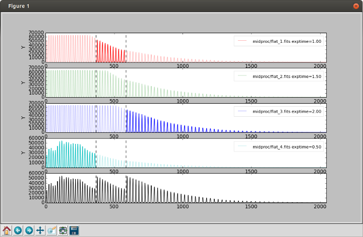

.. _pipeline_foces:

FOCES Pipeline
===============

The FOCES pipeline is used to reduced the raw FITS files generated by FOCES.
The naming of the FITS files follows the :ref:`FOCES naming convention<foces_fitsname>` and
the keywords in the primary header follows the :ref:`FOCES FITS standard<foces_fitsfile>`\ .
The procedure of the reduction of FOCES data includes:

#. Creation of log & configuration files;
#. Overscan correction;
#. Bias subraction;
#. Dark current correction;
#. Flat fielding correction;
#. Order location;
#. Background subtraction;
#. 1-D spectra extraction;
#. Wavelength calibration.

.. _foces_fitsname:

Naming Convention
-----------------

The FOCES naming convention for observational files is::

    YYYYMMDD_NNNN_XXXYYNN_XXXN.fits

Where

* `YYYYMMDD` is the year, month and date like `20150730` for July 30th. 2015;
* `NNNN` is the unique daily expossure number from 0001 to 9999;
* `XXXYYNN`:

  * `XXX` is the instrument descriptor (`FOC` means FOCES);
  * `YYNN` is the year and revision. e.g. `1501` for setup 01 2015. Revision counts up with hardware changes, such as new fibers, changed alignments, new calibration lamps.

* `XXXN`: Exposure type and descriptor.

  * `FLA` means FlatField, `0` means Blue, `1` means Green, and `2` means Red;
  * `DAR` means Dark
  * `WAV` means Wavelength calibrator. N= `1` means ThAr, N= `2` means UNe
  * `SCI` means Science target. N= `0` means Star alone, N= `1` means Single fiber cal, N= `2` means Double fiber cal, and N= `3` means Iodine cell cal

Below lists the intrument codes:

* `FOC` means FOCES
* `BOE` means BOES (TBC)
* `W1M` means Weihai 1m echelle spectrograph
* `X2M` means Xinglong 2m echelle spectrograph

.. _foces_fitsfile:

FITS Standards
--------------

**FITS** (**F**\ lexible **I**\ mage **T**\ ransport **S**\ ystem) has been
widely used to storage images in astronomy.
The latest FITS standard (version 3.0) is defined by Pence et al. 2010
[#Pence2010]_.
Briefly speaking, the FITS file is composed of a primary header and data unit
(HDU) and optional extensions.
For the raw data files generated by FOCES, the single image FITS with only one
primary HDU is used.
The primary HDU contains a header and a data array.
The header is composed of a number of 80-character records.
Each record contains a keyword name, a value and an optional comment.
The keyword name shall has 8 left-justified, and space-filled characters.
The following keywords for a 2-D image array are fixed in the beginning of the
primary HDU according to the FITS standard document::

    SIMPLE  =                    T / file does conform to FITS standard
    BITPIX  =                   16 / number of bits per data pixel
    NAXIS   =                    2 / number of data axes
    NAXIS1  =                 2088 / length of data axis 1
    NAXIS2  =                 2048 / length of data axis 2

Below shows an example of keywords in the primary HDU of FITS files.
The first two and last two rows with digits are used to rule the length of
header rows::

  0         1         2         3         4         5         6         7         8
  012345678901234567890123456789012345678901234567890123456789012345678901234567890
   SIMPLE  =                    T / file does conform to FITS standard
   BITPIX  =                   16 / number of bits per data pixel
   NAXIS   =                    2 / number of data axes
   NAXIS1  =                 2088 / length of data axis 1
   NAXIS2  =                 2048 / length of data axis 2
   BSCALE  =                    1 / factor to linearly scale the data pixel values
   BZERO   =                32768 / offset to linearly scale the data pixel values
   BUNIT   = 'ADU     '           / physical unit of the data pixel values
   BLANK   =               -32768 / value representing undefined physical values
   DISPAXIS=                    1 / main dispersion axis of the spectral data
   DATATYPE= 'science '           / type of data (calibration/science)
   OBJECT  = '51 Peg  '           / object observed
   DATE-OBS= '2015-03-03'         / start date of observation run
   MJD-OBS =                56380 / Modified Julian Date of observation run
   TIMESYS = 'UTC     '           / time system
   FRAMEID =                   15 / frame ID in observation run
   RA      = '22:57:27.9800'      / right ascension of object
   DEC     = '+20:46:07.791'      / declination of object
   RADESYS = 'ICRS    '           / name of reference frame
   EQUINOX = ''                   / epoch of the mean equator and equinox in years
   EXPTIME =               1800.0 / exposure time in seconds
   PHO-OFF =                  3.2 / offset of photon middle time
   UTC-STA = '2015-03-03T20:14:23.120' / UTC at start of exposure
   UTC-MID = '2015-03-03T20:14:23.120' / UTC at middle of exposure
   UTC-PHO = '2015-03-03T20:14:23.120' / UTC at photon middle of exposure
   UTC-END = '2015-03-03T20:14:23.120' / UTC at end of exposure
   LT-STA  = '2015-03-03T21:14:23.120' / local time at start of exposure
   LT-MID  = '2015-03-03T21:14:23.120' / local time at middle of exposure
   LT-PHO  = '2015-03-03T21:14:23.120' / local time at photon middle of exposure
   LT-END  = '2015-03-03T21:14:23.120' / local time at end of exposure
   LST-STA = '2015-03-03T12:23:15.120' / local sidereal time at start
   LST-MID = '2015-03-03T12:23:15.120' / local sidereal time at middle
   LST-PHO = '2015-03-03T12:23:15.120' / local sidereal time at photon middle
   LST-END = '2015-03-03T12:23:15.120' / local sidereal time at end
   MJD-STA =         56380.241560 / Modified Julian Date of UTC-STA
   MJD-MID =         56380.241560 / Modified Julian Date of UTC-MID
   MJD-PHO =         56380.241560 / Modified Julian Date of UTC-PHO
   MJD-END =         56380.241560 / Modified Julian Date of UTC-END
   AIRM-STA=                1.321 / airmass at start of exposure
   AIRM-MID=                1.340 / airmass at middle of exposure
   AIRM-PHO=                1.341 / airmass at photon middle of exposure
   AIRM-END=                1.354 / airmass at end of exposure
   AIRMASS =                1.331 / effective airmass during exposure
   ALT-STA =               70.345 / telescope altitude at start
   ALT-MID =               75.244 / telescope altitude at middle
   ALT-PHO =               75.010 / telescope altitude at photon middle
   ALT-END =               78.248 / telescope altitude at end
   AZ-STA  =              118.642 / telescope azimuth at start
   AZ-MID  =              120.456 / telescope azimuth at middle
   AZ-PHO  =              123.104 / telescope azimuth at photon middle
   AZ-END  =              128.834 / telescope azimuth at end
   MOON-AGE=                16.4  / days past new moon at middle of exposure
   MOON-ALT=                      / moon altitude at middle of exposure
   MOON-AZ =                      / moon azimuth at middle of exposure
   MOON-DIS=                 23.5 / angular distance to moon (in degree)
   TWI-END = '2015-03-03T18:14:23' / end time of astronomical twilight in UTC
   TWI-STA = '2015-03-04T05:24:13' / start time of astronomical twilight in UTC
   PROP-ID = '2016001 '           / proposal ID
   PROP-TIT= 'measuring the RM effect' / title of proposal
   PROP-PI = 'Frank Grupp'        / principal investigator of proposal
   OBSERVER= 'Liang Wang'         / people who acquire the data
   OBSERVAT= 'Wendelstein Obs.'   / observatory where the data is acquired
   TELESCOP= 'Fraunhofer 2.2m'    / telescope used to acquire the data
   OBS-LONG= '102:24:13.200'      / longitude of the telescope
   OBS-LAT = '+20:21:12.560'      / latitude of the telescope
   OBS-ALT =                945.0 / altitude of the telescope in meter
   INSTRUME= 'FOCES   '           / instrument used to acquire the data
   SETUP-ID= '2016002 '           / ID of the instrument setup
   SLT-WID =                  0.5 / slit width (in mm)
   SLT-LEN =                  2.0 / slit length (in mm)
   NCHANNEL=                    2 / number of simultaneous channels
   CHANNEL1= 'science'            / object of channel 1
   CHANNEL2= 'comb'               / object of channel 2
   FILTER1 = ''                   / filter in channel 1
   FILTER2 = ''                   / filter in channel 2
   EXPMETER=                    T / usage of exposure meter
   SHAK_STA=                    F / status of fiber shaker (on/off)
   SHAK_FRE=                  1.0 / frequency of fiber shaker (in Hz)
   SHAK_AMP=                    2 / amplitude of fiber shaker
   DETECTOR= 'Andor   '           / detector used to acquire the data
   GAIN    =                  1.0 / readout gain of detector (in electron/ADU)
   RO-SPEED=               2.0e-5 / read out speed of detector
   RO-NOISE=                  3.4 / read out noise of detector
   BINAXIS1=                    1 / binning factor of data axis 1
   BINAXIS2=                    1 / binning factor of data axis 2
   TEMP-DET=                  -80 / temperature of detector (in degree)
   TEMP-BOX=                   15 / temperature inside instrument box (in degree)
   TEMP-ROO=                   20 / temperature inside instrument room (in degree)
   PRES-BOX=                  900 / pressure inside instrument box (in hPa)
   DATE    = '2015-03-03T17:22:10' / file creation date
   ORI-NAME= '20150303020.fits'   / original filename
   ORIGIN  = 'USM LMU '           / organization responsible for the FITS file
   HEADVER = '1.0     '           / version of header

   END
  0         1         2         3         4         5         6         7         8
  012345678901234567890123456789012345678901234567890123456789012345678901234567890

Below are explanations for keywords

#. Keywords describing the data array

   The arrays generated by the FOCES controlling computer are 3-D by default,
   with the length of the 3rd direction equal to 1.
   These should be converted to 2-D arrays so that EDRS2 does not need a special
   treatment for FOCES data. **BSCALE** and **BZERO** are used to linearly scale
   the array values to the physical values by

   *physical_value* = **BZERO** + **BSCALE** × *array_value*

   Here we use **BZERO** = 32768 and **BSCALE** = 1 to represent unsigned,
   16-bit integers in the CCD in a signed integer FITS array.
   **BUNIT** is the unit of physical values (in our case, ADU of the CCD).
   **BLANK** = -32768 means we use the unsigned 0 to represent the undefined
   physical value in the pixel.
   **DISPAXIS** describes the axis along which the main dispersion direction is.

#. Keywords describing the observed objects

   There are two kinds of “data types”, i.e. the calibration (including bias,
   flat, dark, ThAr, … ) and the science (a real observed object).
   This information is stored in the **DATATYPE** as characters ('calibration'
   or 'science'). **RADESYS** and **EQUINOX** specify the coordinate system and
   the epoch of the object. Their allowed values are

   ========================================== =========== =========================
   Definition                                 **RADESYS** **EQUINOX**
   ========================================== =========== =========================
   International Celestial Reference System   ICRS
   Mean place, new (IAU 1984) system          FK5         a floating Julian year
   Mean place, old (Bessel-Newcomb) system    FK4         a floating Besselian year
   Mean place: but without eccentricity terms FK4-NO-E    a floating Besselian year
   Geocentric apparent place, IAU 1984 system GAPPT
   ========================================== =========== =========================

   The allowed **OBJECT** values are any characters specifying the science
   object or the calibration object, such as '51 Peg', 'HD 122563', 'Flat', or
   'Laser Comb'.
   
#. Keywords describing the observation information

   **DATE-OBS** is the start date of an observation run.
   The observation run is defined as a whole process contains a series of
   calibration frames (including bias, flat, ThAr…) and the optional science
   frames (depending on whether any celestial object is observed).
   The start date shall always be kept as the date before the mid-night.
   **MJD-OBS** is the Modified Julian Date of **DATE-OBS**\ .
   **FRAMEID** is an unique integer identifying the FITS file.
   This number shall start from 1 and increase with time in every observation
   run, but may not be continuous. **DATE-OBS** and **FRAMEID** can be used to
   identify a raw FITS file generated by FOCES.

#. Keywords describing the time of exposure

   **TIMESYS** specifies the time scale used in the header.
   The allowed values include `UT`, `UTC`, `TAI`, `AT`, `ET`, `UT`, `TDT`,
   `TDB`, `TCG`, and `TDB`. The `GPS` has been deprecated.
   There are four groups of keywords describing the time, i.e., `UTC-XXX`
   (Coordinated Universal Time), `LT-XXX` (local time), `LST-XXX` (local
   sidereal time), and `MJD-XXX` (Modified Julian Date), where `XXX` are either
   `STA` (start of the exposure), `MID` (middle time of the exposure), `PHO`
   (photon-weighted middle time of the exposure), or `END` (end of the
   exposure).
   Similarly, the pointing angle of the telescope, and airmass of the above four
   time points are recorded to estimate the atmospheric extinction.
   The effective airmass is calculated as

   **AIRMASS** = (**AIRM_STA** + 3 × **AIRM_MID** + **AIRM_END**)/5.

   The keywords related to the airmass are empty if **DATATYPE** =
   `calibration`.
   Additionally, the **MOON-PHA**, **MOON-DIS**, **TWI-END**, and **TWI-STA**
   are included to estimate the sky background level of the spectral image.

#. Keywords related to the multi-channel

   A channel is defined as the light from different objects fed by a specific
   fiber before the slit.
   **NCHANNEL** describes the number of used channel.
   In normal mode, **NCHANNEL** = 1, and = 2 if simultaneous reference technique
   is used.
   **CHANNELn** describe the objects fed in each channel, where n = 1, 2, ...
   **NCHANNEL**.
   The allowed values are `science`, `flat`, `ThAr`, `comb`.
   Similarly, **FILTERn** specify the used filter (if any) in each channel.

#. Keywords related to the exposure meter

   The exposure meter (or photon counter) is often used in precise Doppler
   measurements to determine the effective time points of the radial velocity
   data.
   The logical keyword **EXPMETER** is introduced to specify whether the
   exposure meter is switched on during the exposure.
   **PHO-OFF** is used to measure the offset between the photon-weighted middle
   time and the middle time.
   The unit of the value in **PHO-OFF** is second.
   **PHO-OFF** = 1.0 means the the photon-weighted middle time = middle time +
   1.0 sec.
   If the exposure meter is off, **PHO-OFF** = 0., and all keywords ended with
   **-PHO** are kept the same as those with **-MID**.

See also:

    * `The FITS standard document <http://fits.gsfc.nasa.gov/standard30/fits_standard30aa.pdf>`_ maintained by the IAU FITS Working Group (November 2010)
    * `Systems of Time <http://tycho.usno.navy.mil/systime.html>`_ by USNO

Log & Config Files
------------------
The list of different type of exposures (flat, bias, science...) is given in the
configuration file (`*****.cfg`).
Users can also change the parameters used in EDRS2 (e.g. degree of polynomials
in the background correction, scanning intervals in order location...).
Below is an example::

    [reduction]
    reduction_id = FOCES_20150304_A
    data_path    = rawdata
    mid_path     = midproc
    report_path  = report
    result_path  = result
    saturation   = 63000

    bias    = 2-6
    thar    = 1, 47, 48
    flat_1  = 43
    flat_2  = 44
    flat_3  = 45
    flat_4  = 46
    science = 7-42

    overscan.variation_fig = overscan_variation.png

    bias.cosmic_clip     = 10.
    bias.bias_file       = bias.fits
    bias.smooth_sigma    = 3
    bias.smooth_mode     = nearest
    bias.smooth_file     = bias_smooth.fits
    bias.res_file        = bias_res.fits
    bias.variation_fig   = bias_change.png
    bias.smooth_fig      = bias_smooth.png
    bias.smooth_hist_fig = bias_smooth_hist.png

    flat.flat_file   = flat.fits
    flat.mosaic_file = flat.reg

    trace.trace_file = trace.fits

The configuration file follows the
`RFC822 <https://tools.ietf.org/html/rfc822.html>`_ format, and composed of
several "sessions" marked with `[XXX]`.
It is read by Python built-in
`ConfigParser <https://docs.python.org/2/library/configparser.html>`_ module and
passed to EDRS2.

Usage of FOCES Pipeline
-----------------------

Generation of Observing Log
^^^^^^^^^^^^^^^^^^^^^^^^^^^

The first step is to create a reduction directory and create link to the raw
data in this directory.
For example, the raw images (`***.fits`) are saved in `~/data/foces/2015-03-04`,
then the command is:

.. code-block:: bash

    ln -s ~/data/foces/2015-03-04 rawdata

Then, run the following command to generate the obseving log file.
EDRS2 will 

.. code-block:: bash

    edrs2 list

Flat Fielding
^^^^^^^^^^^^^

Flats with different exposure times are mosaiced together to generate the final
flat image.
In EDRS2, an interactive interface will be displayed

    
The cross sections of each kind of flat are plotted with different colors.
Then user can simply click the figure to define a mosaic boundary line,
and select which part of the flat is used in the final flat (the lowest one with
black color).
Because the order in the 2D image is not a straight line, the boundary line on
the 2D image lies between two orders, and is carefully calculated to fit the
curvatures of the orders, to avoid any crossing, as shown below:

.. figure:: ../images/flat_mosaic2.png
   :align: center
    
The mosaic module can be used not only 3 kinds of flat (red/green/blue), but any
numbers of kinds.
This step only relies on matplotlib, scipy, and DS9.

Logging
--------
During running, a log file is generated to tell the users what did the program
do, and where is the error occurred if the program quit abnormally.
The log file `edrs.log` is generated in the current working directory by the
Python `logging <https://docs.python.org/2/library/logging.html>`_ module,
and has a clear and machine-readable format, and list the time, module name,
line number of the running place, and the name of function.
As below::

    * 2016-02-29T11:15:39.511 [INFO] __main__ - 67 - record_system_info():
      Start reduction.
      Node:              wangliang-mbp
      Processor:         1 x Intel(R) Core(TM) i7-2620M CPU @ 2.70GHz (2 cores)
      System:            Linux 3.19.0-51-generic x86_64
      Distribution:      Ubuntu 14.04 trusty
      Memory:            7.7G (total); 4.2G (used); 3.5G (free)
      Username:          wangliang
      Python version:    2.7.6
      Working directory: /home/wangliang/work/foces/reduction/2015-03-04
    --------------------------------------------------------------------------------
    * 2016-02-29T11:15:39.511 [INFO] __main__ - 77 - main():
      arg1 = foces, start reducing FOCES data
    --------------------------------------------------------------------------------
    * 2016-02-29T11:15:39.511 [INFO] edrs.config - 36 - read_config():
      Found config file: "FOCES_20150304_A.cfg"
    --------------------------------------------------------------------------------
    * 2016-02-29T11:15:39.512 [ERROR] edrs.pipeline.foces.reduce_data - 18 - reduce_data():
      data_path: "rawdata" does not exist
    --------------------------------------------------------------------------------

References
-----------
.. [#Pence2010] Pence et al., 2010, *A&A*, 524, 42 :ads:`2010A&A...524A..42P`
